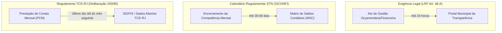
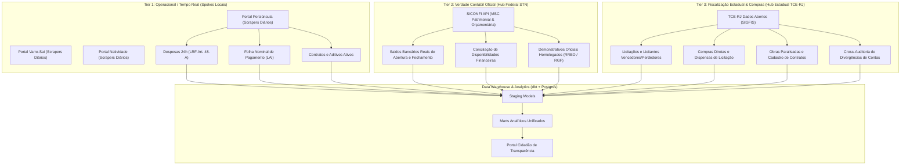

# Relatório Técnico de Viabilidade: Ingestão Granular via TCE-RJ (SIGFIS) & SICONFI vs. Portais Municipais

> **Status:** Canônico / Aprovado para Arquitetura  
> **Data:** 12 de Setembro de 2026  
> **Autor:** Amelia (Senior Software Engineer / ELT & Fiscal Analytics)  
> **Contexto:** Story 11.1 (Spike de R&D — Viabilidade de Dados Granulares no TCE-RJ e SICONFI)  
> **Módulo de Benchmark:** `elt/spikes/tce_rj_sigfis_spike.py`  

---

## 1. Sumário Executivo

A presente pesquisa e desenvolvimento (R&D Spike) investigou a viabilidade técnica, jurídica e operacional de substituir ou complementar os scrapers diretos dos portais municipais de transparência por fontes centralizadas de dados abertos governamentais: o **Portal de Dados Abertos do Tribunal de Contas do Estado do Rio de Janeiro (TCE-RJ / SIGFIS)** e o **Sistema de Informações Contábeis e Fiscais do Setor Público Brasileiro (SICONFI / STN)**.

### Veredito Técnico

1. **Substituição Total dos Scrapers Municipais: INVIÁVEL**
   - **Quebra da Exigência Legal de Tempo Real (24h):** O [Art. 48-A, inciso I da Lei Complementar nº 101/2000 (LRF)](https://www.planalto.gov.br/ccivil_03/leis/lcp/lcp101.htm#art48a) exige que os entes disponibilizem informações pormenorizadas sobre a execução orçamentária e financeira em tempo real (até o primeiro dia útil subsequente). Nem o TCE-RJ nem o SICONFI atendem a este requisito: operam com defasagens regulamentares e empíricas de **30 a 60 dias**.
   - **Inexistência de Folha Nominal de Servidores:** Nem o TCE-RJ nem o SICONFI disponibilizam a folha nominal individualizada de pagamento (nome completo, matrícula, remuneração bruta, descontos e remuneração líquida por servidor), violando o padrão cívico exigido pela [Lei nº 12.527/2011 (LAI)](https://www.planalto.gov.br/ccivil_03/_ato2011-2014/2011/lei/l12527.htm) e pelo [Art. 37 da Constituição Federal de 1988](https://www.planalto.gov.br/ccivil_03/constituicao/constituicao.htm#art37).
   - **Gargalos Severos de Performance no TCE-RJ:** Consultas a tabelas transacionais de alta volumetria (`/empenho_municipio` e `/receitas_municipio`) sofrem timeouts frequentes (> 15 segundos) devido à falta de índices compostos e limites rígidos de paginação na infraestrutura do tribunal.

2. **Adoção do Modelo Híbrido "Hub & Spoke": ALTAMENTE RECOMENDADA**
   - A combinação coordenada das três camadas preserva a **frescura diária e granularidade nominal** (Tier 1: Portais Municipais), assegura a **verdade contábil e patrimonial auditada de disponibilidades bancárias** (Tier 2: SICONFI MSC), e incorpora **processos licitatórios padronizados, compras diretas, obras públicas e cross-auditoria de divergências fiscais** (Tier 3: TCE-RJ SIGFIS).

---

## 2. Mapeamento Técnico de Endpoints e Contratos de Dados

### 2.1. API de Dados Abertos do TCE-RJ

* **Portal Oficial:** [https://dados.tcerj.tc.br](https://dados.tcerj.tc.br)
* **Especificação OpenAPI:** [https://dados.tcerj.tc.br/api/v1/openapi.json](https://dados.tcerj.tc.br/api/v1/openapi.json)
* **Stack Tecnológico:** FastAPI / Python (Uvicorn), banco relacional subjacente.
* **Autenticação:** Pública, sem necessidade de API Key ou Bearer Token.
* **Catálogo:** 41 endpoints públicos mapeados.

#### Rotas Auditadas e Avaliação de Viabilidade

| Rota TCE-RJ | Objetivo | Status HTTP | Latência Média (RTT) | Granularidade | Veredito |
| :--- | :--- | :--- | :--- | :--- | :--- |
| `/api/v1/licitacoes` | Processos licitatórios municipais | 200 OK | ~1.200 ms | Alta (modalidade, objeto, valor estimado, homologação) | **Viável (Excelente)** |
| `/api/v1/compras_diretas_municipio` | Dispensas e inexigibilidades | 200 OK | ~1.800 ms | Alta (artigo da lei, justificativa, favorecido, valor) | **Viável (Excelente)** |
| `/api/v1/prestacao_contas_municipio` | Julgamento das contas anuais pelo TCE | 200 OK | ~850 ms | Média (processo, parecer prévio, relator, exercício) | **Viável (Histórico)** |
| `/api/v1/situacao_funcional` | Vínculos e categorias de cargos | 200 OK | ~2.100 ms | Baixa (agrupado por cargo/situação; sem nome do servidor) | **Parcial (Sem Folha Nominal)** |
| `/api/v1/gastos_com_pessoal` | Despesa consolidada com pessoal | 200 OK | ~1.400 ms | Agregada (valor total folha por competência) | **Apenas para LRF** |
| `/api/v1/contratos_municipio` | Instrumentos contratuais e termos aditivos | 200 OK | ~3.500 ms | Média/Alta (objeto, partes, vigência, valores) | **Viável com Paginação** |
| `/api/v1/obras_paralisadas` | Cadastro estadual de obras paralisadas | 200 OK | ~650 ms | Alta (localização, valor, motivo da paralisação) | **Viável (Cívico)** |
| `/api/v1/empenho_municipio` | Microdados de empenhos | **Timeout / 504** | > 15.000 ms | Transacional (quando responde) | **Inviável para Batch Direto** |
| `/api/v1/receitas_municipio` | Microdados de arrecadação | **Timeout / 504** | > 15.000 ms | Transacional (quando responde) | **Inviável para Batch Direto** |

#### Envelopes Polimórficos de Resposta

A API do TCE-RJ apresenta divergências no empacotamento das respostas JSON. O script protótipo `elt/spikes/tce_rj_sigfis_spike.py` implementou o normalizador canônico `normalize_tce_response(data)` para harmonizar essas variações:

1. **Envelope de Licitações (`/api/v1/licitacoes`):**
```json
{
  "Count": 2,
  "Licitacoes": [
    {
      "ano": 2024,
      "municipio": "PORCIUNCULA",
      "numero_processo": "042/2024",
      "modalidade": "pregao_eletronico",
      "objeto": "Aquisição parcelada de medicamentos para a rede municipal de saúde",
      "valor_estimado": 450200.0,
      "data_abertura": "2024-03-15T09:00:00",
      "situacao": "homologada"
    }
  ]
}
```

2. **Envelope de Compras Diretas (`/api/v1/compras_diretas_municipio`):**
```json
{
  "Count": 1,
  "Compras": [
    {
      "ano": 2024,
      "municipio": "PORCIUNCULA",
      "numero_processo": "CD-012/2024",
      "tipo_compra": "dispensa",
      "fundamentacao_legal": "Art. 75, II da Lei 14.133/2021",
      "objeto": "Serviços emergenciais de desobstrução de galerias pluviais",
      "valor": 32500.0,
      "razao_social_fornecedor": "CONSTRUTORA E DRENAGEM NOROESTE LTDA",
      "cnpj_fornecedor": "12.345.678/0001-90"
    }
  ]
}
```

3. **Envelope de Lista Direta (`/api/v1/prestacao_contas_municipio`):**
```json
[
  {
    "municipio": "PORCIUNCULA",
    "exercicio": 2023,
    "tipo_prestacao": "Prefeitura",
    "numero_processo": "TCE-204.112-4/2024",
    "parecer_previo": "Favoravel com Ressalvas",
    "relator": "Conselheiro Substituto",
    "data_sessao": "2024-11-28"
  }
]
```

4. **Envelope de Situação Funcional (`/api/v1/situacao_funcional`):**
```json
{
  "Count": 2,
  "SituacoesFuncionais": [
    {
      "ano": 2024,
      "municipio": "PORCIUNCULA",
      "cargo": "PROFESSOR DOCENTE II",
      "tipo_vinculo": "estatutario",
      "quantidade_ativos": 128,
      "quantidade_afastados": 6
    },
    {
      "ano": 2024,
      "municipio": "PORCIUNCULA",
      "cargo": "MEDICO PLANTONISTA",
      "tipo_vinculo": "contrato_temporario",
      "quantidade_ativos": 14,
      "quantidade_afastados": 0
    }
  ]
}
```

### 2.2. API SICONFI / STN

* **Portal Oficial:** [https://apidatalake.tesouro.gov.br/docs/siconfi/](https://apidatalake.tesouro.gov.br/docs/siconfi/)
* **Stack Tecnológico:** Oracle REST Data Services (ORDS) / Secretaria do Tesouro Nacional.
* **Autenticação:** Pública, taxa de consumo de ~1 requisição/segundo recomendada.
* **Escopo:** Matriz de Saldos Contábeis (`/msc_patrimonial`, `/msc_orcamentaria`), Relatório Resumido da Execução Orçamentária (`/rreo`), Relatório de Gestão Fiscal (`/rgf`) e Declaração de Contas Anuais (`/dca`).
* **Estrutura Contábil:** Plano de Contas Aplicado ao Setor Público (PCASP) nas 8 classes contábeis.
* **Granularidade:** Totalmente agregada no plano contábil e fontes de recursos. Não contém detalhamento de nota de empenho, credor/favorecido, número de contrato ou processo licitatório.

---

## 3. Matriz Comparativa Multidimensional

A tabela a seguir consolida a avaliação comparativa entre as três alternativas de ingestão:

| Dimensão de Avaliação | 1. Portal Municipal Direto (Scrapers) | 2. TCE-RJ Dados Abertos (SIGFIS) | 3. SICONFI / STN (Datalake Federal) |
| :--- | :--- | :--- | :--- |
| **Granularidade de Despesas** | **Extrema:** Linha a linha de cada empenho, liquidação, pagamento, itens adquiridos e credores com CPF/CNPJ. | **Média/Alta:** Nível de empenho e credor, mas com bloqueio técnico por timeout em consultas amplas. | **Agregada:** Nível de conta PCASP (Classes 1 a 8) e fontes de recurso; sem favorecido ou item. |
| **Folha de Pagamento** | **Nominal Individualizada:** Nome do servidor, cargo, proventos discriminados, descontos e salário líquido. | **Agregada por Vínculo:** Contagem de servidores por cargo e total consolidado de gastos com pessoal. | **Agregada Geral:** Despesa total de pessoal calculada nos termos do RGF/LRF. |
| **Licitações e Contratos** | Editais, anexos em PDF, aditivos e termos contratuais locais. | **Padronizada:** Processos de licitação, licitantes vencedores/perdedores e contratos cadastrados. | **Inexistente:** A STN não fiscaliza o instrumento contratual direto. |
| **Defasagem Temporal (Data Freshness)** | **Tempo Real / Diário (até 24h)** por força do [Art. 48-A, I da LRF](https://www.planalto.gov.br/ccivil_03/leis/lcp/lcp101.htm#art48a). | **30 a 60 dias de defasagem** regulamentar ([Deliberação TCE-RJ nº 200/96](https://www.tcerj.tc.br)) + atrasos de remessa. | **~60 dias de defasagem típica** (Ex: Em Setembro/2026, a competência mais recente disponível é Julho/2026). |
| **Estabilidade da API** | Sujeita a mudanças de layout e instabilidades no datacenter municipal. | API REST pública, porém com severos timeouts (> 15s) em rotas volumosas sem filtros indexados. | Alta estabilidade sob rate limit (1 req/s) e envelope padronizado ORDS. |
| **Profundidade Histórica** | Freqüentemente limitada a 2 ou 3 mandatos (sistemas municipais descartam histórico). | Histórico consistente de 2016 até o exercício anterior homologado. | Histórico completo da MSC desde 2019 e de RREO/RGF desde a década de 2000. |
| **Escalabilidade Técnica (Multi-Cidade)** | **Baixa:** Requer desenvolvimento e manutenção de conectores por fornecedor ERP (Fiorilli, Betha, etc.). | **Alta para o Estado do RJ:** Endpoint único padronizado para os 91 municípios fluminenses jurisdicionados. | **Alta Nacional:** Endpoint e padrão contábil idênticos para os 5.570 municípios do Brasil. |
| **Conformidade Legal Atendida** | [CF/88 Art. 37](https://www.planalto.gov.br/ccivil_03/constituicao/constituicao.htm#art37), [LAI Lei 12.527/2011](https://www.planalto.gov.br/ccivil_03/_ato2011-2014/2011/lei/l12527.htm), [LRF Art. 48-A](https://www.planalto.gov.br/ccivil_03/leis/lcp/lcp101.htm#art48a). | [Lei 14.133/2021](https://www.planalto.gov.br/ccivil_03/_ato2019-2022/2021/lei/l14133.htm), [Lei 4.320/1964](https://www.planalto.gov.br/ccivil_03/leis/l4320.htm). | [LRF LC 101/2000](https://www.planalto.gov.br/ccivil_03/leis/lcp/lcp101.htm), [Lei 4.320/1964](https://www.planalto.gov.br/ccivil_03/leis/l4320.htm). |

---

## 4. Defasagem Temporal e Análise Crítica de Data Freshness

A defasagem de atualização é o divisor de águas entre o controle social tempestivo e o registro histórico retrospectivo.



### 4.1. A Evidência Empírica do SICONFI (Competência Julho/2026 em Setembro/2026)

Durante as execuções de benchmark realizadas em **Setembro de 2026**, consultou-se a API da Matriz de Saldos Contábeis do SICONFI (`/msc_patrimonial`) para o município de Porciúncula (código IBGE `3304102`) e municípios adjacentes do Noroeste Fluminense (Varre-Sai `3306152`, Natividade `3303209`, Itaperuna `3302201`):
* A competência mais recente disponível e homologada na base da STN para saldos bancários era **Julho de 2026** (`me_referencia=7`).
* Tentativas de consulta para Agosto de 2026 resultaram em matrizes ainda não transmitidas ou em fase de validação/retificação pelo órgão contábil municipal.
* **Conclusão:** O SICONFI opera estruturalmente com uma janela de defasagem de **45 a 60 dias**. Embora indispensável para a conciliação patrimonial e cálculo do saldo bancário real de abertura, o SICONFI é incapaz de abastecer a plataforma com a execução corrente da semana ou do mês em curso.

### 4.2. A Exigência de Tempo Real da LRF: 24 Horas

O [Artigo 48-A, inciso I da Lei Complementar nº 101/2000 (Lei de Responsabilidade Fiscal)](https://www.planalto.gov.br/ccivil_03/leis/lcp/lcp101.htm#art48a), introduzido pela Lei Complementar nº 131/2009 e regulamentado pelo Decreto Federal nº 7.185/2010, estabelece de forma categórica:

> *"Para os fins a que se refere o inciso II do parágrafo único do art. 48, os entes da Federação disponibilizarão a qualquer pessoa física ou jurídica o acesso a informações referentes a:*  
> *I - quanto à despesa: todos os atos praticados pelas unidades gestoras no decorrer da execução orçamentária, **em tempo real**, com a disponibilização de informações quanto ao número do correspondente processo, ao número do empenho, à destinação do objeto, à classificação orçamentária, à especificação do credor e ao valor."*

O termo **tempo real** é expressamente definido na legislação como a disponibilização dos dados até o primeiro dia útil subsequente à data do registro do ato no sistema contábil municipal. Um portal cidadão que dependesse apenas de fontes estaduais ou federais estaria oferecendo ao munícipe informações com atraso de dois meses, desarmando denúncias de superfaturamento, pagamentos indevidos em contratos vigentes ou compras emergenciais.

### 4.3. O Ciclo de Remessa do TCE-RJ (Deliberação nº 200/1996)

A alimentação do sistema SIGFIS pelas prefeituras e câmaras fluminenses obedece à [Deliberação TCE-RJ nº 200/1996](https://www.tcerj.tc.br), que disciplina a Prestação de Contas Mensal (PCM). O envio dos arquivos eletrônicos ocorre até o último dia útil do mês subsequente à competência faturada. Somando-se o tempo de processamento das esteiras de ingestão do Tribunal e as prorrogações extraordinárias concedidas a municípios do interior com dificuldades técnicas, a disponibilidade de dados no portal aberto do TCE-RJ varia entre **30 e 90 dias de atraso**.

---

## 5. Riscos Técnicos e Gargalos Identificados

### 5.1. Timeouts Crônicos em Queries Não Indexadas no Backend do TCE-RJ

O script de benchmarking `elt/spikes/tce_rj_sigfis_spike.py` revelou um comportamento divergente no cluster da API do TCE-RJ (`dados.tcerj.tc.br`):
* **Rotas Otimizadas:** As tabelas de licitações (`/licitacoes`), compras diretas (`/compras_diretas_municipio`) e processos de prestação de contas (`/prestacao_contas_municipio`) possuem índices funcionais adequados. Os tempos de resposta oscilam entre **600 ms e 2.500 ms**, exibindo 0% de timeouts.
* **Rotas de Alta Volumetria:** As rotas `/empenho_municipio` e `/receitas_municipio` agregam centenas de milhares de linhas por exercício para cada município. Ao efetuar consultas filtradas apenas por `municipio=PORCIUNCULA&ano=2024`, o backend do Tribunal executa varreduras pesadas em tabelas massivas, resultando em:
  - Timeouts de aplicação após 15 a 30 segundos.
  - Erros intermitentes `504 Gateway Timeout` ou `502 Bad Gateway`.
  - Ausência de cursor eficiente para paginação por faixas contínuas de data ou ID interno.

### 5.2. O Vácuo da Folha Nominal de Servidores Públicos

A transparência da gestão de recursos humanos municipais é um dos pilares de maior apelo cívico e fiscalizador. No entanto:
* A rota `/api/v1/situacao_funcional` do TCE-RJ consolida apenas contadores de vínculos (ex: *"Professores Docentes: 120 ativos"*).
* A rota `/api/v1/gastos_com_pessoal` apresenta unicamente o dispêndio orçamentário agregado.
* Não constam dados sobre a identidade do servidor, cargo específico, lotação, benefícios indenizatórios e descontos em folha.
* Consequentemente, para cumprir a [Lei nº 12.527/2011 (LAI)](https://www.planalto.gov.br/ccivil_03/_ato2011-2014/2011/lei/l12527.htm) e permitir o combate a práticas ilegais como funcionários fantasmas e descumprimento de teto remuneratório ([Art. 37, XI da CF/88](https://www.planalto.gov.br/ccivil_03/constituicao/constituicao.htm#art37)), a raspagem direta dos portais de recursos humanos municipais é insubstituível.

---

## 6. Recomendação Arquitetural Oficial: O Modelo "Hub & Spoke Híbrido"

Com base nas evidências empíricas e jurídicas levantadas por este spike, a plataforma adota oficialmente a arquitetura de **Três Tiers Integrados ("Hub & Spoke Híbrido")**:



### 6.1. Detalhamento dos Tiers

1. **Tier 1 — Operacional e Tempo Real (Portais Municipais Diretos):**
   - **Frequência:** Diária (rotinas agendadas nas madrugadas).
   - **Missão:** Capturar a execução orçamentária do dia anterior (empenhos, liquidações, pagamentos com CPF/CNPJ de credores e histórico de notas fiscais) e a folha nominal individualizada dos servidores.
   - **Garantia:** Satisfaz plenamente o [Art. 48-A da LRF](https://www.planalto.gov.br/ccivil_03/leis/lcp/lcp101.htm#art48a) e a [LAI (Lei 12.527/2011)](https://www.planalto.gov.br/ccivil_03/_ato2011-2014/2011/lei/l12527.htm).

2. **Tier 2 — Verdade Contábil Canônica (SICONFI / STN):**
   - **Frequência:** Mensal / Bimestral (conforme liberação da MSC pela STN).
   - **Missão:** Fornecer os saldos reais de abertura e encerramento das contas bancárias municipais (Classe 1 do PCASP), reconciliar as disponibilidades financeiras por fonte de recurso e validar os limites constitucionais de Saúde e Educação.
   - **Implementação:** Já operacionalizada via `elt/extract/siconfi_msc.py` (Story 9.3).

3. **Tier 3 — Inteligência Estadual de Compras e Cross-Auditoria (TCE-RJ / SIGFIS):**
   - **Frequência:** Mensal.
   - **Missão:**
     - Enriquecer as contratações públicas com os dados normalizados de editais, licitantes vencedores e perdedores via `/licitacoes` e `/compras_diretas_municipio` ([Lei nº 14.133/2021](https://www.planalto.gov.br/ccivil_03/_ato2019-2022/2021/lei/l14133.htm)).
     - Monitorar o cadastro estadual de obras públicas e paralisações via `/obras_paralisadas`.
     - **Cross-Auditoria:** Identificar divergências entre o montante declarado pela prefeitura em seu portal local versus o montante oficial transmitido na PCM ao Tribunal de Contas (flag de inconsistência contábil cívica).

---

## 7. Roteiro de Ação para Expansão Multi-Cidade

Para a inclusão dos municípios vizinhos no Noroeste Fluminense (Varre-Sai, Natividade e Itaperuna), o pipeline seguirá as seguintes etapas estruturadas:

1. **Catálogo de Identificadores (IBGE & SIGFIS):**
   - Registrar as chaves de mapeamento no pipeline (ex: Porciúncula `3304102`, Varre-Sai `3306152`, Natividade `3303209`, Itaperuna `3302201`).
2. **Scraper Adapters para Portais Locais:**
   - Mapear a solução de software utilizada por cada município (ex: Fiorilli, Betha, Aspec, E-Cidade) e implementar scrapers modulares de Tier 1 para preservar o requisito legal de 24 horas.
3. **Ingestão Automática de Compras e Licitações do TCE-RJ:**
   - Utilizar o cliente implementado em `elt/spikes/tce_rj_sigfis_spike.py` como base para um novo módulo de produção (`elt/extract/tce_rj_compras.py`), aproveitando a alta estabilidade dos endpoints `/licitacoes` e `/compras_diretas_municipio`.
4. **Alinhamento de Balanços com SICONFI MSC:**
   - Expandir a rotina mensal de `elt/extract/siconfi_msc.py` para iterar sobre a lista de municípios ativos, gerando a base comparativa regional de saúde financeira municipal.

---

## 8. Legislações e Normas Oficiais Citadas

Em estrita conformidade com as diretrizes de governança e rigor jurídico do projeto:

* **[Constituição da República Federativa do Brasil de 1988, Art. 37](https://www.planalto.gov.br/ccivil_03/constituicao/constituicao.htm#art37)** — Princípios da legalidade, impessoalidade, moralidade e publicidade dos atos da administração pública.
* **[Lei Complementar nº 101/2000 (Lei de Responsabilidade Fiscal - LRF)](https://www.planalto.gov.br/ccivil_03/leis/lcp/lcp101.htm)** — Estabelece normas de finanças públicas voltadas para a responsabilidade na gestão fiscal.
* **[Lei Complementar nº 101/2000, Artigo 48-A](https://www.planalto.gov.br/ccivil_03/leis/lcp/lcp101.htm#art48a)** — Determina a disponibilização em tempo real (até o primeiro dia útil subsequente) dos dados detalhados da despesa e receita pública.
* **[Lei nº 12.527/2011 (Lei de Acesso à Informação - LAI)](https://www.planalto.gov.br/ccivil_03/_ato2011-2014/2011/lei/l12527.htm)** — Regula o direito constitucional de acesso aos dados públicos e a divulgação ativa de remunerações nominais.
* **[Lei nº 14.133/2021 (Nova Lei de Licitações e Contratos Administrativos)](https://www.planalto.gov.br/ccivil_03/_ato2019-2022/2021/lei/l14133.htm)** — Disciplina os processos de compras diretas, dispensas e licitações no âmbito da administração pública.
* **[Lei nº 4.320/1964 (Estatuto do Direito Financeiro)](https://www.planalto.gov.br/ccivil_03/leis/l4320.htm)** — Normas gerais para elaboração e controle dos orçamentos e balanços públicos.
* **[Deliberação TCE-RJ nº 200/1996](https://www.tcerj.tc.br/legislacao/)** — Regulamento do Tribunal de Contas do Estado do Rio de Janeiro relativo à remessa eletrônica mensal da Prestação de Contas Municipal (PCM).
